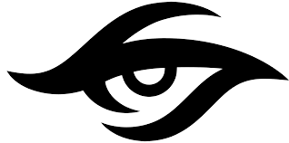

<!DOCTYPE html>
<html lang="en">
<head>
    <meta charset="UTF-8">
    <meta http-equiv="X-UA-Compatible" content="IE=edge">
    <meta name="viewport" content="width=device-width, initial-scale=1.0">
    <title>Document</title>
    <link rel="stylesheet" href="bootprojectstyle.css" type="text/css">
</head>
<body>
    <header id="head">
        <nav id="nav" class="leftrightspace">
            

                    
                    

                        <a href="#">HOME</a>
                        <a href="#">SKILLS</a>
                        <a href="#">PROJECTS</a>
                        <a href="#">ABOUT</a>
                    

            

            

                <button id="contact">Contact</button> 
            

        </nav>
        

            

                
            

            

                <h6>Full Stack Web Developer</h6>
                <h1>Hi, I'm Swetha</h1>
                
I am pasionate about building web applications, and I am a self-tought web developer. My goal is to create web applications that are user-friendly, and that are easy to use.

                

                <button id="view">View My Work</button>
                

            

        

    </header>
</body>
</html>
